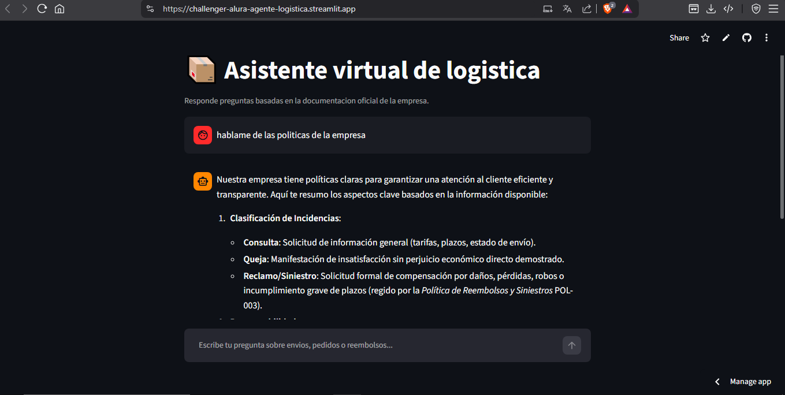
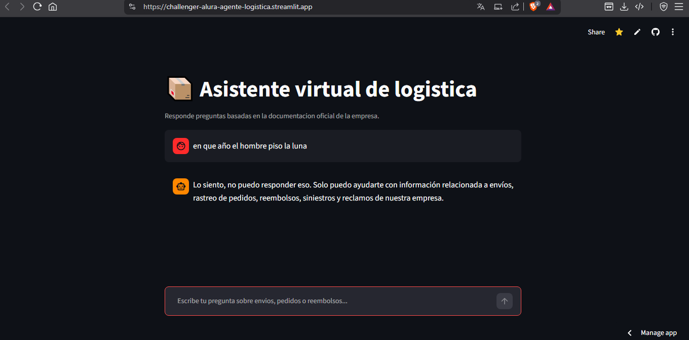

# 📦 Asistente Virtual de Logística (RAG con Cohere + FAISS)

Agente conversacional tipo chatbot que responde preguntas de atención al cliente basándose **exclusivamente** en la documentación oficial de una empresa de logística (envíos, rastreo de pedidos, reembolsos, siniestros y reclamos), utilizando una arquitectura RAG (Retrieval-Augmented Generation).

----------

## 📋 Descripción general

Este proyecto implementa un agente de IA capaz de responder consultas de clientes de una empresa de logística usando únicamente la información contenida en 5 documentos oficiales:

-   Preguntas frecuentes
-   Procedimiento de rastreo de pedidos
-   Proceso de reclamos y atención al cliente
-   Política de reembolsos y siniestros
-   Política de envíos

El agente **no responde con conocimiento externo**: si el usuario pregunta algo fuera del alcance de estos documentos, el asistente indica explícitamente que no está programado para responder eso, evitando así respuestas inventadas o inexactas (alucinaciones).

La interfaz es un chat interactivo construido con **Streamlit**, desplegado públicamente en **Streamlit Community Cloud**.

----------

## 🏗️ Arquitectura de la solución

El proyecto sigue el patrón **RAG (Retrieval-Augmented Generation)**:

```
 ┌─────────────┐      ┌───────────────────┐      ┌──────────────────┐
 │  5 PDFs de  │ ---> │  Chunking (texto) │ ---> │  Embeddings       │
 │  logística  │      │  LangChain        │      │  (Cohere)         │
 └─────────────┘      └───────────────────┘      └──────────────────┘
                                                            │
                                                            v
                                                  ┌──────────────────┐
                                                  │  Índice vectorial │
                                                  │  FAISS            │
                                                  └──────────────────┘
                                                            │
        Usuario pregunta                                   │
              │                                            v
              v                                  ┌──────────────────┐
     ┌────────────────┐    contexto relevante     │  Retriever        │
     │ Interfaz Chat  │ <------------------------ │  (búsqueda por    │
     │  (Streamlit)   │                            │  similitud)      │
     └────────────────┘                            └──────────────────┘
              │                                            │
              v                                            v
     ┌────────────────────────────────────────────────────────────┐
     │      LLM Cohere (command-a-03-2025) + Prompt del sistema   │
     │      Responde SOLO con base en el contexto recuperado      │
     └────────────────────────────────────────────────────────────┘

```

### Flujo del proceso

1.  **Ingesta**: los 5 PDFs se cargan y se dividen en fragmentos (chunks) de texto.
2.  **Vectorización**: cada chunk se transforma en un vector numérico (embedding) usando el modelo `embed-multilingual-v3.0` de Cohere.
3.  **Indexación**: los vectores se almacenan en un índice **FAISS**, persistido en disco (`vectorstore/faiss_index/`).
4.  **Recuperación (Retrieval)**: cuando el usuario hace una pregunta, se busca en el índice los fragmentos más relevantes semánticamente.
5.  **Generación (Generation)**: esos fragmentos se pasan como contexto al modelo de lenguaje de Cohere (`command-a-03-2025`), junto con un prompt de sistema que restringe la respuesta únicamente a la información de los documentos.
6.  **Interfaz**: el usuario interactúa con todo este proceso a través de un chat construido en Streamlit.

----------

## 🛠️ Tecnologías y herramientas utilizadas

| Tecnología | Uso en el proyecto |
|---|---|
| **Python 3.12** | Lenguaje base del proyecto |
| **Streamlit** | Interfaz de chat web |
| **LangChain** (`langchain`, `langchain-classic`, `langchain-community`, `langchain-text-splitters`) | Orquestación del pipeline RAG: carga de documentos, chunking, cadenas de recuperación y generación |
| **langchain-cohere** | Integración de LangChain con los modelos de Cohere |
| **Cohere** | Modelo de embeddings (`embed-multilingual-v3.0`) y modelo de lenguaje (`command-a-03-2025`) |
| **FAISS** (`faiss-cpu`) | Base de datos vectorial para búsqueda por similitud |
| **PyPDF** | Extracción de texto de los documentos PDF |
| **python-dotenv** | Manejo de variables de entorno (API Key) en local |
| **Streamlit Community Cloud** | Plataforma de despliegue |
| **GitHub** | Control de versiones y repositorio del proyecto |

----------

## ▶️ Instrucciones para ejecutar el proyecto

### Requisitos previos

-   Python 3.12 instalado
-   Una API Key gratuita de Cohere: [dashboard.cohere.com/api-keys](https://dashboard.cohere.com/api-keys)

### Pasos

```bash
# 1. Clonar el repositorio
git clone <url-del-repositorio>
cd challenger-alura

# 2. Crear entorno virtual
py -3.12 -m venv venv

# 3. Activar entorno virtual
venv\Scripts\activate        # Windows
source venv/bin/activate     # Mac/Linux

# 4. Instalar dependencias
pip install -r requirements.txt

# 5. Configurar la API Key
# Crear un archivo .env en la raíz del proyecto con:
# COHERE_API_KEY=tu_clave_aqui

# 6. Generar el índice vectorial (solo la primera vez, o si cambian los PDFs)
python scripts/build_index.py

# 7. Ejecutar la aplicación
streamlit run app.py

```

La aplicación se abrirá automáticamente en el navegador, normalmente en `http://localhost:8501`.

### Despliegue en Streamlit Community Cloud

1.  Subir el repositorio a GitHub (sin `.env` ni `venv/`, ya excluidos en `.gitignore`).
2.  Crear cuenta en [share.streamlit.io](https://share.streamlit.io/) iniciando sesión con GitHub.
3.  Seleccionar el repositorio y `app.py` como archivo principal.
4.  En **Advanced settings > Secrets**, agregar:
    
    ```toml
    COHERE_API_KEY = "tu_clave_aqui"
    
    ```
    
5.  Desplegar.

----------

## 💬 Ejemplos de preguntas que el agente puede responder

-   ¿Cómo puedo rastrear mi pedido?
-   ¿Cuánto tiempo tarda en procesarse un reembolso?
-   ¿Qué debo hacer si mi pedido llegó dañado?
-   ¿Cuáles son los tiempos de entrega según la política de envíos?
-   ¿Cómo presento un reclamo ante la empresa?
-   ¿Qué significa el estado "TDD" en el rastreo de mi pedido?

## 🤖 Ejemplos de respuestas generadas por el agente

**Pregunta dentro del dominio:**

> **Usuario:** - ¿Cuáles son los tiempos de entrega según la política de envíos?
> 
> **Asistente:** Según nuestra política de envíos, los tiempos de entrega varían según la zona de destino:

-   **Península Ibérica**: 24-48 horas.
-   **Islas Baleares**: 48-72 horas.
-   **Islas Canarias**: 3-5 días laborables.
-   **Portugal**: 48-72 horas.
-   **Resto de Europa**: 3-7 días laborables, según la zona.

Además, ofrecemos servicios  **Express**  que reducen los plazos estándar en un 50%.

**Pregunta fuera del dominio:**

> **Usuario:** ¿en que año el hombre piso la luna?
> 
> **Asistente:** Lo siento, no puedo responder eso. Solo puedo ayudarte con información relacionada a envíos, rastreo de pedidos, reembolsos, siniestros y reclamos de nuestra empresa.

----------

## 📁 Estructura del proyecto

```
challenger-alura/
├── app.py
├── requirements.txt
├── .env.example
├── assets/
├── config/
├── data/documents/
├── vectorstore/faiss_index/
├── src/
├── scripts/
└── tests/

```

----------

## 🚀 Deploy

La aplicación se encuentra desplegada en Streamlit Community Cloud:

🔗 [https://challenger-alura-agente-logistica.streamlit.app/](https://challenger-alura-agente-logistica.streamlit.app/)

### Capturas de la aplicación



